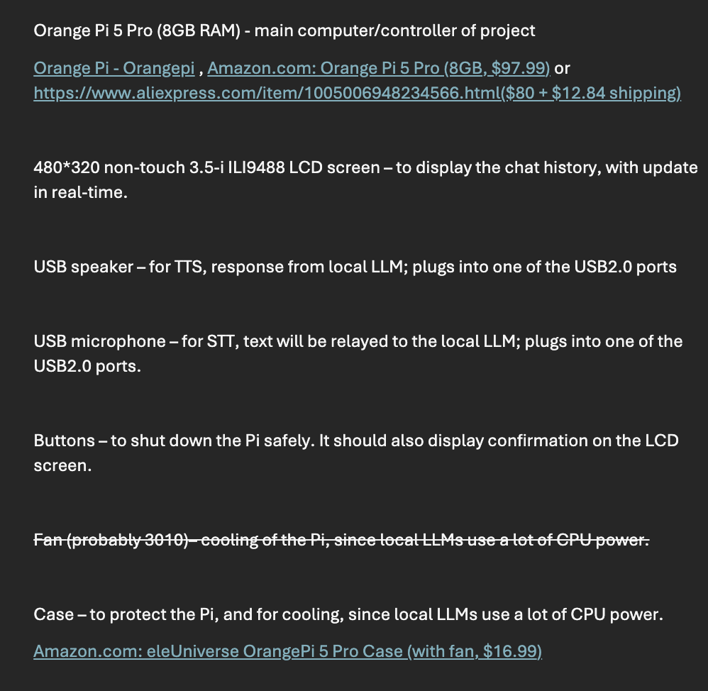

## 25/6/25

### Update 1

This session I started the planning for my project. I decided on the name: Serious Sirius. I also started to think about the features I want to implement. I want it to be a voice assistant that is capable of doing many things, such as answering questions, controlling smart home devices, playing music, and much more.

I also want it to be secure and private, so I will be using open source software and self-hosting it, using Ollama as the LLM runner. I will also be using a Orange Pi as the main device for the voice assistant. That means I will need to implement STT and TTS in my program, as well as a way to control the smart home devices, possibly using Home Assistant.

I started planning in a Word document, but I will move it to this journal (later) so I can keep track of my progress and ideas.

Here is a screenshot of the planning document, as of 25/6:

